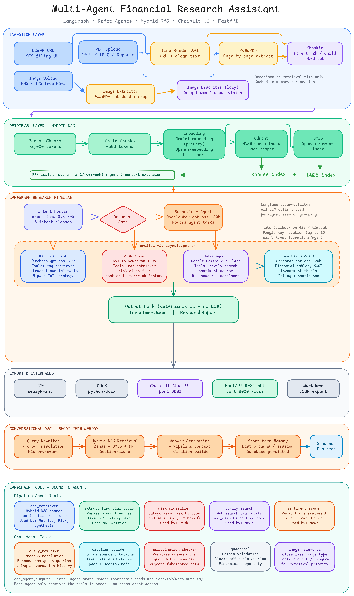

# Financial Research Assistant

A multi-agent financial research system that ingests SEC filings and corporate documents, then runs parallel specialist AI agents to produce structured investment research — investment memos, equity research reports, risk assessments, and sentiment analysis — exportable as PDF, DOCX, or Markdown. Served through a Chainlit chat UI and a FastAPI REST API.

---

## System Architecture



> **Source:** [`full_architecture.excalidraw`](full_architecture.excalidraw) — open in [excalidraw.com](https://excalidraw.com) to explore interactively.

---

## Key Features

- **LangGraph-orchestrated research pipeline** — a supervisor LLM analyses each query and routes to the appropriate combination of Metrics, Risk, and News agents running in parallel via `asyncio.gather`
- **Four specialist ReAct agents** — each agent autonomously decides what to retrieve and when using bound LangChain tools, running multi-turn reasoning loops with up to 5 iterations
- **Hierarchical parent-child chunking** — documents split into ~2,000-token parent chunks (paragraph/table-preserving) and ~500-token child chunks (sentence-level) using Chonkie's RecursiveChunker + SentenceChunker
- **Hybrid retrieval with RRF fusion** — Qdrant HNSW dense vectors combined with BM25 lexical search, merged via Reciprocal Rank Fusion (k=60), with automatic parent-context expansion for wider coverage
- **Section-aware indexing** — SEC filing sections (Risk Factors, MD&A, Financial Statements, Business) are detected at ingest time and stored as metadata for precision retrieval with `section_filter`
- **Multi-provider LLM fallback chains** — per-agent primary/fallback model routing across Cerebras, Groq, Google Gemini, OpenRouter, and NVIDIA with automatic 429/timeout recovery and Google API key rotation (up to 10 keys)
- **Deterministic output generation** — investment memos and full research reports generated from structured synthesis output without an additional LLM call, ensuring zero hallucination in the report structure
- **Conversational RAG chat with short-term memory** — post-analysis Q&A with query rewriting (pronoun resolution), relevance checking, citation building, and session-scoped conversation history
- **Unified intent routing** — single chat interface classifies intent (full pipeline / single agent / RAG Q&A / ingestion / export / chitchat) via an LLM router before dispatching
- **Domain guardrails** — two-stage URL validation (financial domain allowlist + LLM content classification) and document type gating to keep the system on-topic
- **Supabase-backed session persistence** — user-scoped Qdrant collections, document tracking, pipeline result history, and chat history survive page reloads and reconnects
- **Full observability** — LLM call tracing via Langfuse with per-agent trace names, session grouping, and callback-based integration

---

## Architecture Overview

The diagram above covers the full system end-to-end. The key data flows are summarised below.

### Pipeline Flow

Every user message passes through the **Intent Router** (Groq `llama-3.3-70b`) which classifies it into one of 8 intent classes (full pipeline, single agent, RAG Q&A, ingest, export, chitchat, etc.). Full-pipeline requests go through a **Document Gate** that validates domain and document type, then reach the **Supervisor Agent** (OpenRouter `gpt-oss-120b`) which routes focused sub-queries to each specialist agent.

The three specialist agents — **Metrics**, **Risk**, and **News** — run concurrently via `asyncio.gather`. Their outputs are merged by the **Synthesis Agent** into financial tables, a SWOT analysis, and an investment thesis with a buy/hold/sell rating. The **Output Fork** then deterministically formats an `InvestmentMemo` and a `ResearchReport` — no additional LLM call, no hallucination risk in the structure.

### Ingestion Pipeline

Documents enter via two paths:
- **EDGAR URL** → Jina Reader API → clean text extraction
- **PDF Upload** → PyMuPDF page-by-page text extraction
- **Images in PDFs** → PyMuPDF embedded image extractor → stored to disk; described lazily at retrieval time by Groq `llama-4-scout` vision (result cached per session)

Text then goes through SEC section detection (regex on Item 1A, Item 7, Item 8 headers), hierarchical chunking via Chonkie (parent ~2,000 tokens / child ~500 tokens), embedding (Voyage AI → HuggingFace BGE-M3 fallback), and dual-index storage into Qdrant (dense HNSW) and BM25 (sparse, in-memory).

### Retrieval Pipeline

At query time, both indexes are searched in parallel and merged with **Reciprocal Rank Fusion** (`score = Σ 1/(60 + rank)`). Child hits are expanded to their parent chunk for wider context. An optional `section_filter` (e.g. `risk_factors`, `mda`, `financial_statements`) narrows results to the relevant SEC section before returning to the calling agent.

---

## Agents in Detail

### Supervisor Agent
**Model:** OpenRouter `gpt-oss-120b` → HuggingFace `Qwen2.5-72B` fallback

Receives the user query, company name, and ticker. Decides which specialist agents to invoke (all three for comprehensive analysis, or a subset for targeted queries). Produces a `SupervisorDecision` with a focused query tailored per agent and a reasoning trace.

### Metrics Agent
**Model:** Cerebras `gpt-oss-120b` → Groq `llama-3.3-70b` → Groq `qwen3-32b` fallback

Follows a 5-pass Tree-of-Thought retrieval strategy:
1. Income statement pass — revenue, net income, gross/operating margin, EPS
2. Balance sheet pass — total assets, liabilities, debt, cash
3. Cash flow pass — free cash flow, dividends
4. Ratios & segments pass — profitability, liquidity, leverage ratios and segment breakdowns
5. Guidance pass — forward revenue/EPS guidance and management commentary

**Tools:** `rag_retriever` (with `section_filter` targeting MD&A and financial statements), `extract_financial_table` (structured extraction from tabular text)

**Output:** `MetricsOutput` with per-metric current value, prior period value, YoY change, and trend direction.

### Risk Agent
**Model:** NVIDIA `nemotron-3-super-120b` → Cerebras `gpt-oss-120b` → Groq `llama-3.3-70b` fallback

Retrieves the Risk Factors section (Item 1A) with `top_k=12` for broad coverage, identifies distinct risks, and classifies each using the `risk_classifier` tool. Categorises by type (market, regulatory, operational, financial, legal) and severity.

**Tools:** `rag_retriever` (section_filter=`risk_factors`), `risk_classifier`

**Output:** `RiskOutput` with structured risk list, overall risk level, key concern, and confidence score.

### News Agent
**Model:** Google Gemini `gemini-2.5-flash` → Groq `llama-3.3-70b` → Cerebras `zai-glm-4.7` fallback

Searches for recent news using Tavily, then scores sentiment per article using a dedicated fast model (`llama-3.1-8b-instant` via Groq). Covers multiple angles: earnings, competition, regulatory, and sector news.

**Tools:** `tavily_search`, `sentiment_scorer`

**Output:** `NewsOutput` with article list, per-article sentiment, overall sentiment, and key market development.

### Synthesis Agent
**Model:** Cerebras `gpt-oss-120b` → HuggingFace `Qwen2.5-72B` fallback

Receives all three specialist outputs and follows a 6-step structured workflow:
1. Build financial health summary (markdown table with YoY trends)
2. Build valuation snapshot (P/E, D/E, ROE, FCF yield)
3. Build comprehensive key metrics table (all categories combined)
4. Write SWOT analysis grounded in data
5. Write 3–5 paragraph investment thesis
6. Assign investment rating (strong_buy / buy / hold / sell / strong_sell) with rationale

**Tool:** `rag_retriever` for additional cross-section context (business overview, guidance quotes)

**Output:** `SynthesisOutput` with all tables, thesis, rating, and confidence score.

### Chat Agent (Conversational RAG)
**Model:** Uses the `news` model slot (Gemini 2.5 Flash) with short-term memory

Handles post-analysis Q&A with:
- **Query rewriting** — resolves pronouns using conversation history ("their revenue" → "Apple Inc. revenue")
- **Hybrid RAG retrieval** — searches ingested documents for grounded answers
- **Pipeline context injection** — automatically includes the synthesis output (rating, thesis, metrics) so users can ask "what was the rating?" without re-running
- **Citation building** — cites source documents, pages, and sections for each answer
- **Session memory** — last 6 turns stored in `UserSession.chat_history`, persisted in Supabase

---

## Tech Stack

| Layer | Technology |
|-------|------------|
| Agent orchestration | LangGraph, LangChain, asyncio |
| LLM providers | Cerebras, Groq, Google Gemini, OpenRouter (gpt-oss-120b), NVIDIA, HuggingFace Inference |
| Embeddings | Voyage AI (primary), HuggingFace BGE-M3 (fallback) |
| Vector store | Qdrant (HNSW, cosine similarity, user-scoped collections) |
| Sparse retrieval | rank-bm25 |
| Text chunking | Chonkie (RecursiveChunker + SentenceChunker) |
| Document parsing | PyMuPDF (PDF), Jina Reader API (URL/web) |
| Chat UI | Chainlit 2.11+ |
| REST API | FastAPI + Uvicorn |
| Session persistence | Supabase (Postgres via psycopg2) |
| Report export | WeasyPrint (PDF), python-docx (DOCX), Markdown |
| Web search | Tavily API |
| Tracing / observability | Langfuse |
| Evaluation | DeepEval, RAGAS |
| Config / validation | Pydantic v2, python-dotenv |
| Package management | uv |

---

## Prerequisites

- Python 3.12+
- [uv](https://docs.astral.sh/uv/) package manager (`pip install uv`)
- A running Qdrant instance (local Docker or Qdrant Cloud) accessible on port 6333
- Supabase project with a Postgres database (for session/document persistence)
- API keys for at least one LLM provider per agent role (see Environment Variables)

---

## Installation & Setup

1. Clone the repository and navigate to the project root.

2. Install all dependencies:

        uv sync

3. Create a `.env` file in the project root with your API keys and infrastructure URLs. Use the Environment Variables section below as the template.

4. Verify the environment is correctly configured:

        uv run python main.py

   This checks all required API keys, validates Langfuse connectivity, and confirms package imports. Fix any reported missing keys before proceeding.

5. Start Qdrant (if running locally):

        docker run -p 6333:6333 qdrant/qdrant

---

## Running the Application

### Chainlit Chat UI

        uv run chainlit run ui/app.py --port 8001 --watch

Opens at `http://localhost:8001`. The UI provides:
- Natural language analysis requests ("Analyze Apple AAPL" or "Run a full report on INFY NSE")
- SEC EDGAR URL ingestion (paste an EDGAR filing URL directly)
- PDF upload for annual reports, 10-K/10-Q filings, and investor presentations
- Image upload for financial charts and tables (LLM-described and indexed)
- Post-analysis Q&A over ingested documents with cited sources
- One-click export of the investment memo or full research report as DOCX or PDF
- `/help` — command reference
- `/sources` — view ingested document library
- `/clear` — reset the current session
- `/session` — display current session metadata

### FastAPI REST API

        uv run uvicorn api.main:app --port 8000 --reload

Interactive docs available at `http://localhost:8000/docs`.

Key endpoints:
- `POST /analyze/url` — full research pipeline triggered from an EDGAR URL
- `POST /analyze/upload` — full research pipeline triggered from a PDF upload
- `POST /ingest/url` — ingest a URL into the vector store without running agents
- `POST /ingest/upload` — ingest a PDF upload into the vector store
- `POST /agents/metrics` — run only the Metrics Agent
- `POST /agents/risk` — run only the Risk Agent
- `POST /agents/news` — run only the News Agent
- `POST /agents/synthesis` — run only the Synthesis Agent
- `POST /export/pdf` — export a memo or report as PDF
- `POST /export/docx` — export a memo or report as DOCX
- `POST /export/markdown` — export as Markdown
- `POST /export/json` — export as raw JSON
- `GET /health` — health check with provider status

### Diagnostic Check

        uv run python main.py

---

## Environment Variables

### Required

| Variable | Purpose |
|----------|---------|
| `LANGFUSE_SECRET_KEY` | Langfuse tracing secret key |
| `LANGFUSE_PUBLIC_KEY` | Langfuse tracing public key |
| `OPENROUTER_API_KEY` | OpenRouter API (supervisor agent primary model) |
| `HF_TOKEN` | HuggingFace Inference API token (embeddings and fallback models) |
| `JINA_API_KEY` | Jina Reader API for URL-to-text extraction |
| `DB_PASS` | Supabase Postgres password for session persistence |

### LLM Providers

| Variable | Purpose |
|----------|---------|
| `CEREBRAS_API_KEY` | Cerebras inference (metrics and synthesis primary) |
| `NVIDIA_API_KEY` | NVIDIA Nemotron models (risk agent primary) |
| `GROQ_API_KEY` | Groq inference (news fallback, sentiment scorer, intent router) |
| `GOOGLE_API_KEY` | Google Gemini models (news agent primary) |
| `GOOGLE_API_KEY_2` through `GOOGLE_API_KEY_10` | Additional Google keys for automatic rate-limit rotation |

### Embeddings

| Variable | Purpose |
|----------|---------|
| `VOYAGE_API_KEY` | Voyage AI embeddings (primary embedding provider) |
| `NOMIC_API_KEY` | Nomic Atlas embeddings (secondary fallback) |

### Infrastructure

| Variable | Purpose |
|----------|---------|
| `QDRANT_URL` | Qdrant vector store URL (default: `http://localhost:6333`) |
| `QDRANT_API_KEY` | Qdrant API key if authentication is enabled |
| `REDIS_URL` | Redis URL for optional session caching (default: `redis://localhost:6379`) |

### Optional

| Variable | Purpose |
|----------|---------|
| `TAVILY_API_KEY` | Tavily Search API (news agent web search; required for news agent) |
| `LANGFUSE_BASE_URL` | Langfuse self-hosted URL (omit to use Langfuse cloud) |
| `CHAINLIT_AUTH_SECRET` | Secret for Chainlit authentication |
| `API_KEY` | OpenAI-compatible API key for additional custom providers |
| `BASE_URL` | OpenAI-compatible base URL for custom providers |

---

## Project Structure

```
├── agents/
│   ├── base.py              # LLM factory, fallback chains, ReAct loop engine, Langfuse config
│   ├── metrics_agent.py     # 5-pass Tree-of-Thought financial metrics extraction
│   ├── risk_agent.py        # Risk factor retrieval and classification
│   ├── news_agent.py        # Tavily search + per-article sentiment scoring
│   └── synthesis_agent.py   # Cross-agent synthesis, SWOT, investment thesis + rating
│
├── graph/
│   ├── state.py             # ResearchState — shared Pydantic state for the LangGraph
│   ├── workflow.py          # Graph topology: gate → supervisor → agents → synthesis → output_fork
│   └── nodes/
│       └── document_gate.py # Domain and document type validation guard
│
├── ingestion/
│   ├── pdf_reader.py        # PyMuPDF page-by-page text extractor
│   ├── jina_reader.py       # Jina Reader API for URL-to-text with fallback
│   ├── image_extractor.py   # PDF image extraction (PyMuPDF)
│   └── image_describer.py   # LLM-based image description for chart/table images
│
├── chunking/
│   └── chunker.py           # Section detection + parent-child hierarchy chunking (Chonkie)
│
├── retrieval/
│   ├── embedding.py         # Multi-provider embedding fallback chain (Voyage → HF → Nomic)
│   ├── qdrant_store.py      # Qdrant upsert, search, collection management
│   ├── bm25_retriever.py    # BM25 sparse index build and search
│   └── hybrid_retriever.py  # RRF fusion + parent-context expansion
│
├── tools/
│   ├── retriever.py         # LangChain tool wrapper for hybrid RAG retrieval
│   ├── financial.py         # Financial table extraction tool
│   ├── risk.py              # Risk classification tool
│   ├── search.py            # Tavily web search tool
│   ├── sentiment.py         # Per-article sentiment scoring tool
│   ├── state_reader.py      # Inter-agent output accessor
│   └── chat/
│       ├── query_rewriter.py  # Pronoun resolution and query expansion
│       ├── citation_builder.py # Source citation construction
│       └── hallucination_checker.py # Answer grounding verification
│
├── schemas/
│   ├── agents.py            # MetricsOutput, RiskOutput, NewsOutput, SynthesisOutput, SupervisorDecision
│   ├── chunks.py            # ParentChunk, ChildChunk, STANDARD_SECTIONS mapping
│   ├── retrieval.py         # RetrievedChunk, RetrievalResult
│   ├── ingestion.py         # RawDocument, DocumentPage, FilingType, IngestionSource
│   ├── reports.py           # InvestmentMemo, ResearchReport, ReportSection
│   └── chat.py              # ChatResponse schema
│
├── core/
│   ├── orchestrator.py      # Unified message router — maps intent to action
│   ├── intent_router.py     # LLM-based intent classification (8 intent classes)
│   └── domain_validator.py  # URL domain allowlist + LLM content classification
│
├── output/
│   ├── report_generator.py  # Deterministic InvestmentMemo + ResearchReport builder
│   ├── markdown_exporter.py # Markdown rendering utilities
│   ├── pdf_exporter.py      # WeasyPrint PDF generation
│   └── docx_exporter.py     # python-docx DOCX generation
│
├── sessions/
│   ├── session_store.py     # Supabase-backed store with in-memory LRU cache
│   └── session_model.py     # UserSession dataclass (pipeline status, chat history, results)
│
├── chat/
│   └── agent.py             # Conversational RAG agent with query rewriting and session memory
│
├── api/
│   ├── main.py              # FastAPI app setup, health check, router registration
│   ├── models.py            # API request/response Pydantic models
│   └── routers/             # Endpoint modules: analyze, ingest, export, agents, chat
│
├── ui/
│   ├── app.py               # Main Chainlit application — message routing and pipeline execution
│   ├── auth.py              # Chainlit authentication callback
│   ├── components.py        # Reusable UI component helpers (source cards, action buttons)
│   ├── renderers/           # Memo, report, and source rendering to Chainlit messages
│   └── actions/             # Export and pipeline action callback handlers
│
├── test/                    # Test suite (embedding, retrieval, e2e pipeline)
├── config.py                # Central configuration, settings validation, logging setup
├── callbacks.py             # Langfuse callback handler factory
└── main.py                  # Environment verification and startup diagnostic script
```

---

## LLM Fallback Strategy

Each agent has a primary model and one or more fallbacks. The fallback engine in `agents/base.py` handles:

| Trigger | Behaviour |
|---------|-----------|
| HTTP 429 (rate limit) | Switch to next model in chain immediately |
| Request timeout (>30s) | Switch to next model in chain |
| JSON/Pydantic validation failure | Retry on next model with corrected prompt |
| Provider connection error | Skip to next model in chain |
| Google 429 | Rotate to next `GOOGLE_API_KEY_N` before switching model |

Structured output is enforced via the method appropriate for each provider: `json_schema` (Cerebras, OpenRouter), `json_mode` (Groq, NVIDIA, HuggingFace), or `function_calling` (Google Gemini).

---

## Testing

        uv run python test/embedding_test.py      # Embedding provider connectivity
        uv run python test/retrieval_test.py      # Hybrid retrieval correctness
        uv run python test/e2e_pipeline_test.py   # Full pipeline end-to-end

---

## Contributing

1. Fork the repository and create a feature branch.
2. Run `uv run python main.py` to verify your environment before making changes.
3. Follow existing module conventions — each agent, tool, and schema is self-contained with docstrings describing its inputs, outputs, and tool workflow.
4. Add or update tests in `test/` for new agent tools, retrieval changes, or schema modifications.
5. Open a pull request with a clear description of the change, what it affects, and how it was tested.
